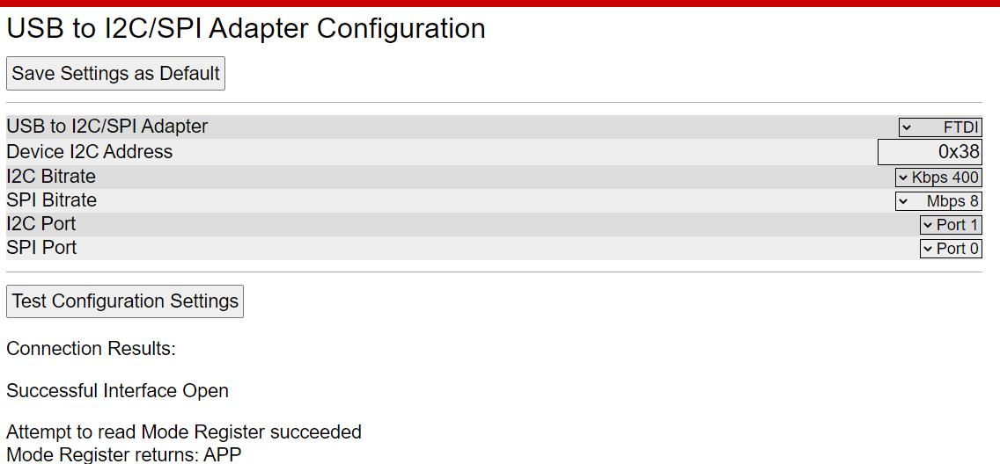

# TPS6598x 调试工具


1. 连接硬件设备
1. 运行程序 gui.py 为主窗口入口 
1. 浏览器内输入http://127.0.0.1:1313/ 即可打开
</br>

如果无法打开，出现404错误，请修改 cheerypy 中配置的 port 
目前本机8080端口被其他程序占用

```
if __name__ == '__main__':
    if len(sys.argv) > 1 :
        port = int(sys.argv[1])
    else :
        port = 8080
    port = 1313 # enzo add
    print(port)
    cherrypy.config.update({'server.socket_host': '127.0.0.1',
                            'server.socket_port': port, })
```


1. web_view.png
